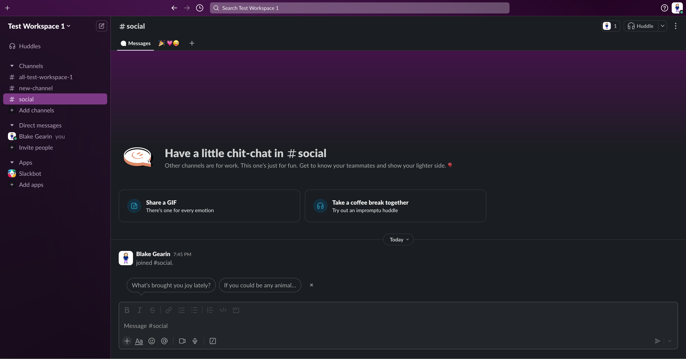
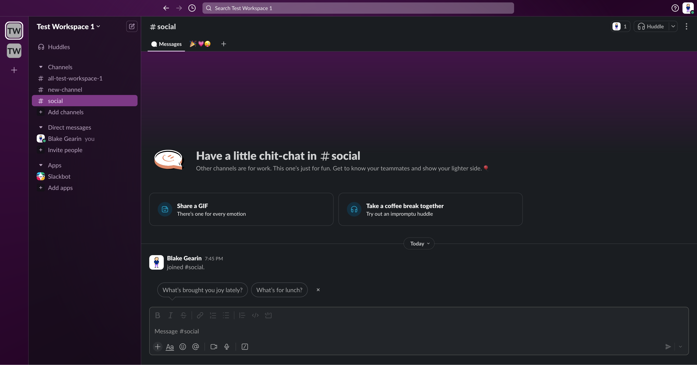

  

# Old School Slack

This is a [userscript](https://openuserjs.org/about/Userscript-Beginners-HOWTO) that updates Slack to look & feel like the old design.

  
  

## Features

- [x] Works out of the box with sensible defaults
- [x] Fills in the gaps between the old and new design (e.g. navigating home from search)
- [x] Cleanly handles sidebar with only icons or icons & text
- [x] Ensures modal dialogs are positioned to keep elements in view
- [x] Preserves visual balance with uniform spacing
- [x] Granular configuration options for deep customization

## Usage

1. Install a userscript manager like [Tampermonkey](https://www.tampermonkey.net), [Violentmonkey](https://violentmonkey.github.io), or [Greasemonkey](https://addons.mozilla.org/en-US/firefox/addon/greasemonkey/)
1. Go to [GreasyFork](https://greasyfork.org/en/scripts/534329-old-school-slack) or [OpenUserJS](https://openuserjs.org/scripts/blakegearin/Old_School_Slack)
1. Click the install button
1. The userscript will open in your userscript manager where you can install it

## Documentation

### Configurations

All features are meant to be toggleable via boolean values. Configuration is stored near the top of the script.

### Archiving

To help maintain this project and in the spirit of aiding future developers, the HTML of the top navigation, tab rail (sidebar), and control strip will be archived periodically. These elements will also be archived in a post-script state with default configuration values.

### Maintenance

This was built with long-term maintenance in mind.

- Minimizing DOM traversal
- Clean logging with levels

## Background

In August 2023, Slack announced and began rolling out a [redesign](https://slack.com/blog/productivity/a-redesigned-slack-built-for-focus). Initially it was possible to set some values to revert the design, but eventually this was removed.

## Credit

- Archiving formatter: [Web Formatter](https://webformatter.com/html)

## Disclaimer

Not affiliated with Slack Technologies LLC, Salesforce, Inc., or any of their affiliations.

## Related Projects

Miss the old navigation of GitHub too? Check out my userscript: [GitHub Custom Global Navigation](https://github.com/blakegearin/github-custom-global-navigation#readme)

Want to use the old Slack favicon? I'm working on a solution for that too: [Favicon Packs](https://github.com/blakegearin/favicon-packs#readme)
